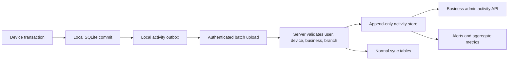

# User Data, Device Activity, and Admin Visibility Research

Date: 2026-06-12

## Executive answer

Piki POS can unify product and transaction data across devices because the app
already uses a local-first SQLite database and a business-scoped PostgreSQL sync
service. However, the current audit trail is not strong enough to support the
claim that an admin can reliably see all activity by user and device.

The recommended design is:

1. Keep operational records such as products, sales, stock, and customers in the
   existing synchronized tables.
2. Add a separate, append-only activity event stream for important business and
   security actions.
3. Bind each event to an authenticated user session and registered device on the
   server. Do not trust `userId` supplied in a request body.
4. Give business admins visibility only into their own business. Give platform
   admins tenant health and support metadata by default, not unrestricted access
   to every customer's detailed activity.
5. Log meaningful actions, not every screen view, click, or keystroke.

## Confirmed product rule

The owner/business admin must be able to see the whole business operated by their
employees:

- every employee account in that business;
- sales, refunds, shifts, cash movements, expenses, purchases, stock changes,
  services, and transfers created by those employees;
- activity from every registered device and every branch;
- the employee, device, branch, time, action, affected record, and result;
- pending sync, failed sync, and resolved/unresolved conflict status.

Employees should continue to see only the features and branches assigned to
them. This full-business access belongs to the business `ADMIN` role only. It
must never include another business's data.

For a genuinely complete view, the admin dashboard should query business-scoped
cloud APIs when online instead of relying only on the admin device's local
SQLite copy. The local database can provide an offline cached view, but the UI
must show `last synced`, pending changes, and offline/stale status.

## Current app behavior

### What already works

- Each device has its own SQLite database and queues pending changes.
- The backend stores synchronized records under a `business_id` and orders
  changes with `server_revision` cursors.
- Products, stock, sales, users, services, branches, and audit logs are included
  in the sync model.
- The app records create, update, and delete mutations with user, role, branch,
  entity, timestamps, and before/after JSON.
- The Flutter business-admin UI has an audit-log feature.
- The audit-log screen defaults to all branches, with an optional current-branch
  filter.
- The client intentionally uses a business-wide sync cursor, so an admin device
  can receive records created on other branches and devices.
- The platform admin currently sees businesses, users, subscription status, and
  user `last_seen_at`, but not a unified device activity timeline.

### What “all activity” currently does not mean

The existing audit records mainly describe local database mutations. They do not
reliably capture:

- which device performed an action;
- which authenticated session performed it;
- login success and failure, logout, token refresh, or device revocation;
- read access, report export, backup, import, sync conflict, or permission denial;
- server-side payment, subscription, eTIMS, messaging, or platform-admin actions;
- trustworthy success/failure outcomes and server receipt times.

## Highest-priority findings

### 1. Audit payloads can expose credential material

`DatabaseService.insert` and `DatabaseService.update` copy entire mutation maps
into `before_json` and `after_json`. The `users` mutation payload contains a
`password` hash. This means creating a user or changing a password can put that
hash into an audit record, which is then synchronized.

Immediate action:

- redact `password`, access tokens, API keys, payment credentials, PINs, and
  sensitive customer fields before audit serialization;
- never show these values in an admin timeline;
- purge already-synchronized sensitive audit payloads after confirming the
  migration and retention requirements.

### 2. User attribution is client-asserted, not authenticated

The backend authenticates sync with one business access token plus a registered
device ID. The sync request separately supplies `userId`, and the server uses it
to update `last_seen_at`. A device that holds the business token can therefore
claim another user ID.

An admin timeline built on this identity would be useful operationally but not a
trustworthy audit trail.

Immediate architectural change:

- issue a per-user access token after login;
- include immutable `user_id`, `business_id`, `role`, `device_id`, and
  `session_id` claims;
- derive the actor from the verified token, never from request JSON;
- keep a separate revocable credential for each device.

### 3. The current audit log is mutable and client-generated

`audit_logs` is an ordinary synchronized table with update, delete, conflict, and
soft-delete fields. A client can create or modify records, and logging failures
are silently ignored so business operations continue.

That is acceptable for a best-effort activity feed, but not for security,
disciplinary, fraud, or compliance evidence.

Recommended change:

- create a server-owned append-only `activity_events` table;
- permit authenticated clients to append through a dedicated endpoint only;
- prohibit client update/delete operations;
- have the server independently generate authentication, authorization,
  platform-admin, payment, export, and sync events;
- record rejected or malformed client events in security telemetry.

### 4. Device records are too thin for device accountability

The current cloud `devices` record contains ID, business, name, and timestamps.
It does not identify the user session, app version, platform, revocation state,
last sync result, or credential rotation.

Add:

- `platform`, `os_version`, `app_version`, `device_label`;
- `status` (`active`, `revoked`, `retired`);
- `registered_by_user_id`, `last_user_id`;
- `last_seen_at`, `last_sync_at`, `last_sync_status`;
- `credential_version`, `revoked_at`, `revoked_by_user_id`;
- optionally coarse IP/security metadata on the server, with a clear retention
  purpose and no precise location collection by default.

### 5. Password handling is coupled to general data sync

The `users` sync configuration still includes `password`, although the backend
currently removes it from canonical responses. Password updates should not pass
through the general record-sync protocol at all.

Recommended change:

- remove `password` from `syncTables.users`;
- use dedicated create-user, reset-password, and change-password endpoints;
- store only the current user's offline verifier on a verified device;
- encrypt local app data at rest or use OS-protected secure storage for offline
  credentials;
- never include password hashes in activity events.

## Admin visibility model

There are two different meanings of “admin” and they should remain separate.

| Role | Default visibility |
| --- | --- |
| Business admin/owner | All operational activity for their business, filtered by allowed branches and retention policy |
| Business manager | Activity for assigned branches/features; no credential or platform-security data |
| Cashier/staff | Their own recent sessions and actions where useful; no other staff surveillance feed |
| Platform support admin | Tenant identity, plan, device health, sync status, error counts, and aggregate usage |
| Platform privileged support | Time-limited, reason-required access to a tenant's detailed data after authorization |

Platform support access should use a “break-glass” workflow:

- require a support ticket/reason;
- require elevated authentication, preferably MFA;
- limit access to one business and a short time window;
- notify or record approval by the business where appropriate;
- log every view, export, and administrative action;
- prevent support staff from viewing password material, secrets, or complete
  payment credentials under any circumstance.

## Recommended event model

Use a table similar to:

```sql
CREATE TABLE activity_events (
  id uuid PRIMARY KEY,
  business_id text NOT NULL,
  branch_id text,
  actor_user_id text,
  actor_role text,
  device_id text,
  session_id uuid,
  event_name text NOT NULL,
  entity_type text,
  entity_id text,
  action text NOT NULL,
  outcome text NOT NULL,
  reason_code text,
  severity text NOT NULL DEFAULT 'info',
  occurred_at_client timestamptz,
  received_at_server timestamptz NOT NULL DEFAULT now(),
  request_id text,
  app_version text,
  source text NOT NULL,
  metadata_json jsonb NOT NULL DEFAULT '{}'::jsonb,
  changes_json jsonb,
  retention_class text NOT NULL DEFAULT 'operational'
);
```

Important properties:

- append-only;
- server-stamped business, actor, device, session, and receipt time;
- unique event IDs for retry/idempotency;
- sanitized metadata with allowlisted keys;
- changed fields or compact patches instead of full database rows;
- indexes on `(business_id, received_at_server)`, user, device, branch,
  event name, and entity;
- optional hash chaining or immutable archive for high-assurance events.

## Event catalog

### Business operations

- `product.created`, `product.updated`, `product.archived`;
- `stock.received`, `stock.adjusted`, `stock.transferred`;
- `sale.completed`, `sale.refunded`, `sale.voided`;
- `expense.created`, `purchase.received`;
- `shift.opened`, `shift.closed`, `cash.movement_recorded`;
- `customer.credit_changed`, without exposing unnecessary customer details;
- `report.exported`, `backup.created`, `data.imported`.

### Identity and security

- `auth.login_succeeded`, `auth.login_failed`, `auth.logout`;
- `session.refreshed`, `session.revoked`;
- `device.registered`, `device.revoked`;
- `user.created`, `user.role_changed`, `user.access_changed`;
- `authorization.denied`;
- `admin.support_access_started`, `admin.data_viewed`,
  `admin.export_created`, `admin.support_access_ended`.

### Sync and reliability

- `sync.started`, `sync.completed`, `sync.failed`;
- `sync.conflict_detected`, `sync.conflict_resolved`;
- `offline.outbox_delayed` for unusually old queued events.

Do not log every tap, page view, search term, or idle period by default. That
creates surveillance risk, excessive volume, and poor signal. Product-level
history should come from meaningful product, stock, sale, and transfer events.

## Offline and multi-device flow



The local outbox should store an event ID, client occurrence time, event type,
entity reference, and sanitized payload. On upload, the server overrides actor,
business, device, session, role, and receipt time from authenticated context.

Product state and product activity are related but separate:

- current product/stock state remains in synchronized operational tables;
- the activity stream explains who changed it, on which device, and why;
- sales and stock movements refer to the same stable product ID across devices;
- admin queries group by business/product and order primarily by server receipt
  sequence, while displaying client time with an offline indicator.

## Conflict-free admin view

“Without conflict” should mean that conflicting edits are detected, preserved,
and explained. It should not mean silently discarding whichever employee update
arrived first.

Recommended rules:

- use stable UUIDs for every business record and activity event;
- keep `business_id` and `branch_id` server-owned;
- include a `base_revision` on updates and compare it with the current
  `server_revision`;
- automatically merge only independent field changes;
- reject or queue overlapping edits as an unresolved conflict;
- keep both versions and show the admin who changed each version and from which
  device;
- require an admin/manager resolution for financially or operationally important
  conflicts;
- make event uploads idempotent so offline retries do not create duplicate sales
  or activity rows;
- display pending, synced, conflict, and failed badges in the admin view.

For append-only records such as completed sales, refunds, payments, and activity
events, use corrections/reversals rather than editing the original record. This
produces a clearer employee audit trail and avoids destructive conflict
resolution.

## Privacy and data governance

For a Kenya-facing product, the activity feature should be designed around the
Data Protection Act principles of lawful and transparent processing, explicit
purpose, data minimization, accuracy, security, and limited retention. This is a
product-design summary, not legal advice.

Required product controls:

- tell staff what activity is collected, why, who can see it, and how long it is
  retained;
- define separate purposes for security logs, operational audit, support, and
  analytics;
- collect only fields needed for those purposes;
- avoid precise location, message contents, clipboard data, keystrokes, and
  continuous screen tracking;
- provide access correction/export workflows where legally required;
- document retention and deletion schedules;
- perform a data-protection impact assessment before broad employee monitoring,
  profiling, automated discipline, or precise location tracking;
- maintain breach response and access-review procedures.

Suggested product baseline, subject to legal/accounting review:

- detailed operational activity: 90 to 180 days in the normal UI;
- security and privileged-admin events: 12 months;
- longer retention only for a defined legal, fraud, contractual, or accounting
  purpose;
- aggregate, de-identified metrics can be retained longer;
- transaction records required for accounting/tax should have their own policy
  and should not be confused with staff behavior logs.

## Admin UI proposal

### Business admin

Add an `Activity` section with filters for:

- date/time;
- branch;
- user;
- device;
- event category and outcome;
- product/customer/sale/entity ID;
- high-risk events only.

Views:

- chronological activity feed;
- product history;
- staff summary based on business outcomes, not raw surveillance;
- device inventory with last seen, last sync, app version, and revoke action;
- export with explicit permission and an export event.

### Platform admin

Default dashboard:

- active devices and versions;
- last successful sync and queued/failing tenants;
- aggregate event volume and error rates;
- suspicious authentication/device patterns;
- no tenant transaction contents or staff timelines by default.

## Authorization and isolation

Every activity query must enforce `business_id` on the server. Branch and role
filters must also be server-side. PostgreSQL row-level security can add defense in
depth so an omitted application filter does not expose another tenant's rows.

Do not rely only on hidden UI controls. Test cross-business, cross-branch, manager,
cashier, revoked-device, expired-session, and platform-support cases.

## Delivery plan

### Phase 0: immediate protection

- redact sensitive audit fields;
- remove password handling from generic sync;
- ensure existing admin APIs never return password hashes or tokens;
- add tests proving redaction;
- define business-admin versus platform-admin data boundaries.

### Phase 1: trustworthy identity and devices

- introduce user sessions and per-device credentials;
- derive actor identity from tokens;
- add device revocation and session rotation;
- record login/auth/device events on the server.

### Phase 2: activity pipeline

- add `activity_events` and a local outbox;
- add an idempotent batch append endpoint;
- add server-generated business and security events;
- add retention jobs and indexes.

### Phase 3: admin experience

- build business activity, product history, and device screens;
- add pagination, filters, export permissions, and alerts;
- add platform aggregate health views and break-glass support access.

### Phase 4: hardening

- enable database defense-in-depth policies;
- test offline clocks, replay, duplicate events, tampering, and lost devices;
- complete privacy notices, impact assessment, retention review, and incident
  procedures;
- monitor log access itself.

## Research sources

- [Kenya Law legislation database](https://new.kenyalaw.org/legislation/)
- [Kenya Data Protection (General) Regulations](https://new.kenyalaw.org/akn/ke/act/ln/2021/263/eng@2022-12-31)
- [NIST SP 800-92: Guide to Computer Security Log Management](https://csrc.nist.gov/pubs/sp/800/92/final)
- [OWASP Logging Cheat Sheet](https://cheatsheetseries.owasp.org/cheatsheets/Logging_Cheat_Sheet.html)
- [PostgreSQL Row Security Policies](https://www.postgresql.org/docs/current/ddl-rowsecurity.html)

## Relevant code locations

- `lib/core/services/database_service.dart`: mutation auditing and local schema
- `lib/core/services/sync_service.dart`: device sync and business-wide cursor
- `lib/core/services/audit_log_service.dart`: current activity queries
- `backend/src/businessAccess.js`: business token and device authentication
- `backend/src/server.js`: sync, platform admin, user identity, and reports
- `backend/src/syncTables.js`: synchronized fields and tables
- `backend/src/syncHelpers.js`: canonical response filtering
- `admin-web/src/components/Dashboard.jsx`: current platform-admin visibility
